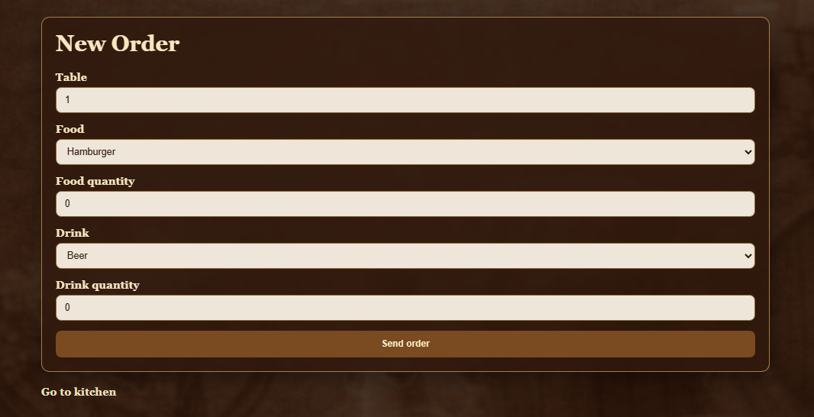
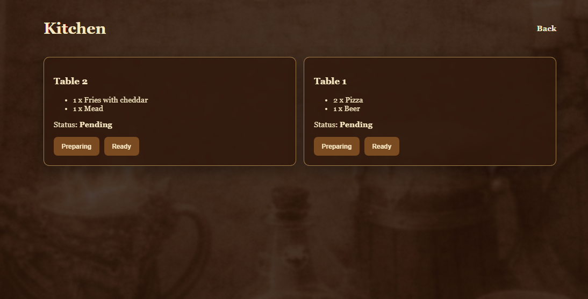

Valdrak Ordering System

Este proyecto nació como parte de mi camino de aprendizaje como desarrolladora Fullstack Junior.
La idea era construir una aplicación simple pero real, que me permitiera integrar varias tecnologías modernas y entender cómo se conectan entre sí en un proyecto completo.

Valdrak Ordering System simula el flujo de pedidos dentro de una taberna ficticia llamada Valdrak. La aplicación permite crear pedidos desde una interfaz sencilla, visualizar los pedidos desde una vista de cocina y actualizar su estado a medida que avanza el proceso.

Para desarrollarlo utilicé Next.js con TypeScript, lo que me permitió trabajar con una estructura moderna de frontend y backend dentro del mismo proyecto. También integré MongoDB Atlas como base de datos para almacenar los pedidos y poder trabajar con datos persistentes.

Durante el desarrollo aparecieron varios desafíos interesantes. Uno de los principales fue la integración con MongoDB en la nube, donde tuve que configurar correctamente la conexión, las variables de entorno y los accesos de red del cluster. También surgieron algunos problemas relacionados con el tipado de TypeScript y las rutas dinámicas de Next.js, que me obligaron a investigar más a fondo la documentación y entender mejor cómo funciona el framework.

Algo que influyó mucho en la forma de trabajar este proyecto es que también tengo conocimientos en QA manual. Eso me llevó a prestar mucha atención a la validación de datos, al manejo de errores y a probar cada funcionalidad mientras la iba construyendo.

Más allá de ser un ejercicio técnico, este proyecto fue una experiencia muy valiosa porque me permitió enfrentar problemas reales de desarrollo y resolverlos paso a paso. Me ayudó a entender mejor cómo se construye una aplicación fullstack y a ganar confianza trabajando con herramientas que hoy son muy utilizadas en el desarrollo web.

En futuras versiones me gustaría seguir mejorando el proyecto, agregando funcionalidades como actualizaciones en tiempo real, autenticación de usuarios y una interfaz más completa para la gestión de pedidos.

Este proyecto forma parte de mi proceso de aprendizaje continuo como desarrolladora, donde busco seguir creciendo, experimentando y construyendo nuevas ideas.

## Live Demo

https://valdrak-ordering-system.vercel.app/

## Screenshots

### New Order

  

### Kitchen Dashboard

  

